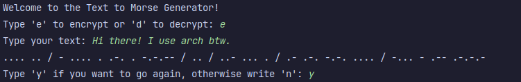
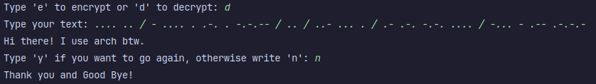

# Text to Morse

---

## Overview 

---

This is a simple python text-based program that converts text into morse and vice-versa. It also considers punctation as well as capitalizing the first letter of every sentence.

I made it for an assignment in Angela Yu's course on Python on Udemy. I did not take help from any solutions. I did everything myself except getting the dictionary data from GeeksforGeeks and googling to get a refresher on how to use values to get keys from a dictionary. 

## Features

---

- Convert text to morse
- Convert morse to text
- Punctation is preserved
- First letter of every sentence is capitalized


## How to Install and Run the Project

---

1. **Clone the Repository**: 
   - Open your terminal or command prompt.
   - Navigate to the directory where you want to clone the repository.
   - Run the following command:
     ```shell
     git clone https://github.com/nfalck/texttomorse.git
     ```

2. **Navigate to the Project Folder**:
   - Change the directory to the project folder:
     ```shell
     cd texttomorse
     ```
   
3. **Run the Application**:
   - Execute the following command to start the application:
     ```shell
     python main.py
     ```


## How It Works

---

### Encryption



### Decryption




## Credits

---

I took the dictionary data from [GeeksforGeeks](https://www.geeksforgeeks.org/morse-code-translator-python/).

For getting the keys from the values I took help from [these notes](https://note.nkmk.me/en/python-dict-get-key-from-value/).

## License

---

This project is licensed under the MIT License - see the [LICENSE.md](LICENSE.md) file for details.
